<!--
SPDX-License-Identifier: CC-BY-SA-4.0
See LICENSE file for licensing information.
-->

> This documentation is organized by AI with reference to actual code. AI can make mistakes — please verify against the source code when in doubt.


# IOL Images with iol-runner (Cisco CML containerized IOL) as Docker Nodes

## Overview

IOL images packaged with Cisco CML's container runner — for example
`iol-xe/iol-xe:17-18-02` (IOS-XE 17.18.02 IOL in a scratch image driven by
`iol-runner`, module `virl.lab/cmd/iol-runner`) — run as first-class GNS3
Docker router nodes with **zero changes to the image**. The integration adds
two generic server mechanisms:

1. **Unix-socket NIO** (`GNS3_UNIX_SOCKET_NIO=1`, on `VendorDockerVM`): link
   adapters through per-interface AF_UNIX datagram sockets instead of a TAP
   interface moved into the container's network namespace.
2. **`IOLDockerVM`** (marker `GNS3_IOL_RUNNER=1`): generates the runner's
   config file per start, prepares its runtime directory and cleans up stale
   sockets — the iol-runner-specific glue on top of the vendor path.

## How the image works

```mermaid
graph LR
    subgraph Container["scratch container (PID 1)"]
        RUNNER["/iol-runner -config /config/iol-config.json -stdio"]
        IOL["IOL process<br/>(IOS-XE 17.18.02)"]
        NETIOMUX["netiomux"]
        SOCKETS["/tmp/s00.sock (recv)<br/>/tmp/c00.sock (send-to path)<br/>… one pair per interface"]
        RUNNER -->|"spawn -e/-s/-m + app id"| IOL
        IOL -->|"netio bus /tmp/netio&lt;uid&gt;/"| NETIOMUX --> SOCKETS
    end
    subgraph Host
        UBRIDGE["uBridge bridgeN<br/>add_nio_unix …/gns3/unixio/&lt;node&gt;/cNN.sock …<br/>+ add_nio_udp (topology)"]
        RTDIR["/run/user/&lt;uid&gt;/gns3/unixio/&lt;node&gt;<br/>(bind-mounted at /tmp)"]
        VOL["project-files/docker/&lt;node&gt;/config<br/>(+ tmp/run, nested bind at /tmp/run)"]
    end
    SOCKETS <-->|"same files, two spellings<br/>(the /tmp bind)"| RTDIR <--> UBRIDGE
    UBRIDGE -.->|"iol-config.json +<br/>persistent /tmp/run"| VOL
```



* **Console**: the runner muxes the IOS console onto PID 1 stdio (`-stdio`
  entrypoint flag). The plain `console_type: "telnet"` attaches to it — no
  `docker_exec` needed. The runner requires a TTY, which GNS3 always
  allocates; without one the runner exits (`inappropriate ioctl for device`).
* **Networking**: the runner does not touch the container's network
  namespace. Per interface N it creates, inside the container's `/tmp`: a
  receive socket `s%02d.sock` (frames sent there are injected into guest
  interface N) and a send-to path `c%02d.sock` (whoever binds it receives
  the guest's frames). Frames are **raw Ethernet**, one datagram per frame —
  the same two-mailbox convention uBridge's `add_nio_unix` natively speaks
  (it binds the c-socket, sends to the s-socket). GNS3 bind-mounts a
  per-node directory from the runtime directory
  (`/run/user/<uid>/gns3/unixio/<node-id>`, next to the uBridge control
  sockets) at the container's `/tmp`, so uBridge reaches the sockets as
  plain host files: the path stays far under AF_UNIX's 107-byte `sun_path`
  cap (a projects-tree node path alone exceeds it) and the directory is
  owned by the server user, to whom the runner drops its privileges. This
  mirrors how CML itself runs the image (`source=…/tmp,target=/tmp` in its
  node definition). The directory is ephemeral and removed with the node.
* **Licensing**: the image ships a self-consistent `/etc/hostid` + `.iourc`
  pair, and the runner regenerates the license from the host ID at boot —
  nothing to configure.
* **Persistence**: `/tmp/run` (the IOL working directory) holds the NETMAP,
  the startup-config (`config`, plain IOS format) and NVRAM (`nvram_00001`).
  It is the only `/tmp` path that needs to survive: GNS3 bind-mounts the
  node directory's `tmp/run/` at `/tmp/run` (nested inside the runtime-dir
  bind), so the router's configuration survives stop/start and container
  recreation while sockets, netio buses and runner logs stay ephemeral.
  The generated config maps the runner to the server's uid/gid
  (`user-id`/`group-id`), so all files it creates are owned by the server
  user (no permission-fix pass needed).

## Template

Create the template once via `POST /v3/templates` (authenticated — see the
API docs for the auth flow), or in the Web UI under
*Edit → Preferences → Docker templates → New* with the same fields:

```json
{
    "name": "IOS-XE 17.18.02 IOL",
    "template_type": "docker",
    "image": "iol-xe/iol-xe:17-18-02",
    "category": "router",
    "symbol": ":/symbols/router.svg",
    "adapters": 2,
    "console_type": "telnet",
    "environment": "GNS3_IOL_RUNNER=1",
    "extra_volumes": ["/config"]
}
```

| Field | Value | Why |
|---|---|---|
| `environment` | `GNS3_IOL_RUNNER=1` | The switch that selects `IOLDockerVM` (skip-init, unix-socket NIO, auto volumes). Optional: `GNS3_IOL_MEMORY=<MB>` (default 2048). |
| `extra_volumes` | `["/config"]` | `/tmp/run` is auto-added. **Never add `/tmp`** — it would persist the socket directory into the projects tree and uBridge would reject the too-long AF_UNIX path. |
| `adapters` | number of 4-port units | The IOU convention: one adapter = `Ethernet0/0`–`Ethernet0/3`, two adapters add `Ethernet1/0`–`1/3`, … (8 units / 32 ports max). Ports are addressed as (adapter, port 0–3) and shown grouped in the UI. |
| `memory` | optional; `0` (default) = no cap | Unset works — Docker applies no limit. When you do set a cap, keep it at IOL memory + ~512 MB, or the cgroup OOM-killer shoots the router. |
| `console_type` | `telnet` | The runner muxes the IOS console onto PID 1 stdio; `docker_exec` is not needed. |

### Verify

1. The node's port list shows the grouped IOL interfaces
   (`Ethernet0/0`–`Ethernet1/3` for two adapters), addressed
   (adapter, port).
2. Drop a node into a project and start it — the console shows the
   `Linux Unix (i686)` banner within seconds.
3. `$XDG_RUNTIME_DIR/gns3/unixio/<node-id>/` contains `s00.sock`… (one
   pair per port).
4. The startup-config lives at
   `project-files/docker/<node>/tmp/run/config` (interface names
   `Ethernet0/0`, not `GigabitEthernet0/0`).

## Server mechanisms

| Mechanism | Where | What it does |
|---|---|---|
| `GNS3_UNIX_SOCKET_NIO=1` | `VendorDockerVM` | `_add_ubridge_connection` override: `bridge create` + `bridge add_nio_unix <dir>/c{N:02d}.sock <dir>/s{N:02d}.sock` instead of TAP + `docker move_to_ns`. No TAP allocation, no `set_mac_addr`, namespace untouched. The socket directory is bound from a per-node runtime directory unless a persisted volume already covers it. |
| `GNS3_UNIX_SOCKET_DIR=<dir>` | `VendorDockerVM` | In-container socket directory (default `/tmp`). Any image whose agent exposes the `s%02d`/`c%02d` datagram pairs can use this without the IOL specifics. |
| `GNS3_IOL_RUNNER=1` | `IOLDockerVM` (selected in the manager) | Forces skip-init + unix-socket NIO + the `/config` and `/tmp/run` volumes; on every start writes `<node>/config/iol-config.json` (`num-eth` = adapter count, `num-serial` = 0, memory from `GNS3_IOL_MEMORY`, default 2048), creates `<node>/tmp/run/` (the IOL process dies without it) and removes stale sockets/netio dirs from the socket directory (`tmp/run` is never touched). |
| `restart()` hardening | `IOLDockerVM` | The base `docker restart` would boot the runner on a stale config and leave uBridge wired to the previous run's sockets; reload becomes graceful stop (SIGTERM → NVRAM flush) + full start. |

`GNS3_STOP_TIMEOUT` (default 60) controls the SIGTERM grace period on stop.
Extra iol-runner flags can be passed via `start_command`, e.g. `-keep`
(L1 keepalives) or `-debug 9` (verbose `process.log` — very useful when
diagnosing wiring issues).

## Notes and caveats

* **Memory sizing**: `memory` caps the whole container; the IOL process gets
  `GNS3_IOL_MEMORY` (default 2048 MB). Keep container memory at IOL memory
  + ~512 MB headroom or the OOM-killer will shoot the router.
* **MAC addresses**: the `mac_address` template field and per-adapter custom
  MACs are ignored — IOL derives its own scheme from the node's application
  ID (`aabb.cc{app}{iface}`), e.g. `aabb.cc03.0400`. The ID is derived from
  the node UUID so linked routers always get distinct MACs (nodes sharing an
  ID would silently drop each other's frames as MAC loops).
* **Interface names are IOL-style `Ethernet0/0`**, not `GigabitEthernet0/0`
  (4 ports per unit, matching the adapter-count granularity) — startup
  configs addressing `GigabitEthernet…` are rejected by the parser.
* **Adapters**: one adapter is a 4-port unit (the IOU model): change the
  count while the node is stopped; the config is regenerated on the next
  start (`num-eth` = adapters × 4) and the runner creates the matching
  socket set.
* **Stop before editing**: NVRAM is only flushed on a graceful stop (SIGTERM,
  "cleanup done" in `process.log`); a kill loses the running-config changes
  since the last `write memory`.
* **Class selection is create-time**: toggling `GNS3_IOL_RUNNER` via PUT
  takes effect after a project reload (same as `docker_exec`).
* The startup-config lives at `project-files/docker/<node>/tmp/run/config`;
  `extra_configs` targets under persisted volumes are warned against by the
  generic create path — edit the file directly or paste via the console.
