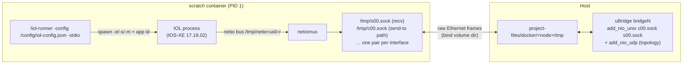

<!--
SPDX-License-Identifier: CC-BY-SA-4.0
See LICENSE file for licensing information.
-->

> This documentation is organized by AI with reference to actual code. AI can make mistakes — please verify against the source code when in doubt.


# IOL Images with iol-runner (Cisco CML containerized IOL) as Docker Nodes

## Overview

IOL images packaged with Cisco CML's container runner — for example
`iol-xe/iol-xe:17-18-02` (IOS-XE 17.18.02 IOL in a scratch image driven by
`iol-runner`, module `virl.lab/cmd/iol-runner`) — run as first-class GNS3
Docker router nodes with **zero changes to the image**. The integration adds
two generic server mechanisms:

1. **Unix-socket NIO** (`GNS3_UNIX_SOCKET_NIO=1`, on `VendorDockerVM`): link
   adapters through per-interface AF_UNIX datagram sockets instead of a TAP
   interface moved into the container's network namespace.
2. **`IOLDockerVM`** (marker `GNS3_IOL_RUNNER=1`): generates the runner's
   config file per start, prepares its runtime directory and cleans up stale
   sockets — the iol-runner-specific glue on top of the vendor path.

## How the image works



* **Console**: the runner muxes the IOS console onto PID 1 stdio (`-stdio`
  entrypoint flag). The plain `console_type: "telnet"` attaches to it — no
  `docker_exec` needed. The runner requires a TTY, which GNS3 always
  allocates; without one the runner exits (`inappropriate ioctl for device`).
* **Networking**: the runner does not touch the container's network
  namespace. Per interface N it creates, inside `/tmp`: a receive socket
  `s%02d.sock` (frames sent there are injected into guest interface N) and a
  send-to path `c%02d.sock` (whoever binds it receives the guest's frames).
  Frames are **raw Ethernet**, one datagram per frame. Because `/tmp` is a
  persisted volume (bind-mounted from the node directory), uBridge can bind
  `cNN.sock` and send to `sNN.sock` on the host.
* **Licensing**: the image ships a self-consistent `/etc/hostid` + `.iourc`
  pair, and the runner regenerates the license from the host ID at boot —
  nothing to configure.
* **Persistence**: `/tmp/run/` inside the volume holds the NETMAP, the
  startup-config (`config`, plain IOS format) and NVRAM (`nvram_00001`), so
  the router's configuration survives stop/start and container recreation.
  The generated config maps the runner to the server's uid/gid
  (`user-id`/`group-id`), which is also what makes the `/tmp` sockets
  reachable by uBridge and all volume files owned by the server user (no
  permission-fix pass needed).

## Template

```json
{
    "name": "IOS-XE 17.18.02 IOL",
    "template_type": "docker",
    "image": "iol-xe/iol-xe:17-18-02",
    "category": "router",
    "symbol": ":/symbols/router.svg",
    "adapters": 4,
    "console_type": "telnet",
    "environment": "GNS3_IOL_RUNNER=1",
    "extra_volumes": ["/config", "/tmp"],
    "memory": 2560
}
```

`/config` and `/tmp` are auto-added even if omitted; listing them keeps the
template self-documenting.

## Server mechanisms

| Mechanism | Where | What it does |
|---|---|---|
| `GNS3_UNIX_SOCKET_NIO=1` | `VendorDockerVM` | `_add_ubridge_connection` override: `bridge create` + `bridge add_nio_unix <dir>/c{N:02d}.sock <dir>/s{N:02d}.sock` instead of TAP + `docker move_to_ns`. No TAP allocation, no `set_mac_addr`, namespace untouched. Fails node creation if the socket dir is not a persisted volume. |
| `GNS3_UNIX_SOCKET_DIR=<dir>` | `VendorDockerVM` | Socket directory (default `/tmp`). Any image whose agent exposes the `s%02d`/`c%02d` datagram pairs can use this without the IOL specifics. |
| `GNS3_IOL_RUNNER=1` | `IOLDockerVM` (selected in the manager) | Forces skip-init + unix-socket NIO + the two volumes; on every start writes `<node>/config/iol-config.json` (`num-eth` = adapter count, `num-serial` = 0, memory from `GNS3_IOL_MEMORY`, default 2048), creates `<node>/tmp/run/` (the IOL process dies without it) and removes stale `s/c??.sock` + `netio*` left by an unclean kill (`tmp/run` is never touched). |
| `restart()` hardening | `IOLDockerVM` | The base `docker restart` would boot the runner on a stale config and leave uBridge wired to the previous run's sockets; reload becomes graceful stop (SIGTERM → NVRAM flush) + full start. |

`GNS3_STOP_TIMEOUT` (default 60) controls the SIGTERM grace period on stop.
Extra iol-runner flags can be passed via `start_command`, e.g. `-keep`
(L1 keepalives) or `-debug 9` (verbose `process.log` — very useful when
diagnosing wiring issues).

## Notes and caveats

* **Memory sizing**: `memory` caps the whole container; the IOL process gets
  `GNS3_IOL_MEMORY` (default 2048 MB). Keep container memory at IOL memory
  + ~512 MB headroom or the OOM-killer will shoot the router.
* **MAC addresses**: the `mac_address` template field and per-adapter custom
  MACs are ignored — IOL derives its own scheme (`aabb.cc00.0XY0`).
* **Adapters**: change the adapter count while the node is stopped; the
  config is regenerated on the next start and the runner creates the
  matching socket set (IOL granularity is 4 ports per unit).
* **Stop before editing**: NVRAM is only flushed on a graceful stop (SIGTERM,
  "cleanup done" in `process.log`); a kill loses the running-config changes
  since the last `write memory`.
* **Class selection is create-time**: toggling `GNS3_IOL_RUNNER` via PUT
  takes effect after a project reload (same as `docker_exec`).
* The startup-config lives at `project-files/docker/<node>/tmp/run/config`;
  `extra_configs` targets under persisted volumes are warned against by the
  generic create path — edit the file directly or paste via the console.
