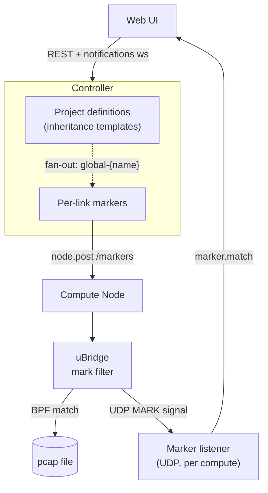
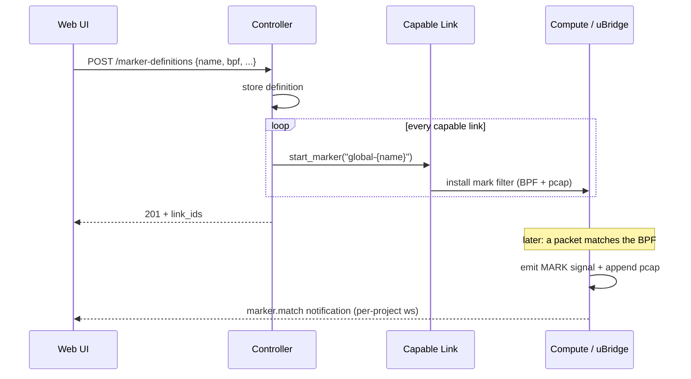

<!--
SPDX-License-Identifier: CC-BY-SA-4.0
See LICENSE file for licensing information.
-->

> This documentation is organized by AI with reference to actual code. AI can make mistakes — please verify against the source code when in doubt.

# Marker (Traffic Insight)

## Overview

A **marker** is a passive traffic-insight tap attached to a link. It runs a libpcap BPF
expression inside uBridge; on every match uBridge emits a real-time `MARK` signal and
appends the matching packet to a per-marker pcap file. Markers exist at two layers that
coexist on the same link: **per-link private markers** and **project-level definitions**
that are inherited by every capable link.

## Architecture



Inheritance is a controller-only fan-out: a definition CRUD loops over links and reuses the
existing per-link marker operations, so the compute side sees an ordinary marker and is
unchanged. Each compute process runs one UDP listener serving every uBridge on that host;
the `node` field in each signal identifies the source.

## Business Process



Updating a definition syncs `bpf / tag / color / highlight_duration` to every inherited
copy; deleting a definition removes every inherited copy. A newly created link inherits all
existing definitions automatically.

## API Endpoints

All endpoints require a JWT bearer token (`POST /v3/access/users/authenticate`). The
`Auth` column lists the required privilege.

### Per-link markers

| Method | Path | Description | Auth |
|--------|------|-------------|------|
| GET | `/v3/projects/{pid}/links/{lid}/markers` | List markers on a link | Link.Audit |
| POST | `/v3/projects/{pid}/links/{lid}/markers` | Attach a marker | Link.Modify |
| PUT | `/v3/projects/{pid}/links/{lid}/markers/{name}` | Update a marker | Link.Modify |
| DELETE | `/v3/projects/{pid}/links/{lid}/markers/{name}` | Remove a marker | Link.Modify |

### Project-level definitions

| Method | Path | Description | Auth |
|--------|------|-------------|------|
| GET | `/v3/projects/{pid}/marker-definitions` | List definitions + bound `link_ids` | Project.Audit |
| POST | `/v3/projects/{pid}/marker-definitions` | Create definition (fans out to every link) | Project.Modify |
| PUT | `/v3/projects/{pid}/marker-definitions/{name}` | Update definition (syncs all copies) | Project.Modify |
| DELETE | `/v3/projects/{pid}/marker-definitions/{name}` | Delete definition (clears all copies) | Project.Modify |

### Aggregation

| Method | Path | Description | Auth |
|--------|------|-------------|------|
| GET | `/v3/projects/{pid}/markers` | All markers across links, flat | Project.Audit |

The link object returned by `GET /v3/projects/{pid}/links[/{lid}]` also carries a `markers`
field (including inherited markers), so the Web UI can render a link's markers without an
extra request.

## Request / Response

**Marker create body** (`MarkerCreate`, shared by per-link POST and PUT):

```json
{
  "name": "icmp",
  "bpf": "icmp",
  "tag": 1,
  "color": "#ff5722",
  "highlight_duration": 800,
  "enabled": true
}
```

**Definition create body** (`MarkerDefinitionCreate`, shared by POST and PUT):

```json
{
  "name": "arp",
  "bpf": "arp",
  "tag": 5,
  "color": "#ff5722",
  "highlight_duration": 1200
}
```

**Marker entry** (returned by GET/POST/PUT, and the value of each link's `markers[name]`):

```json
{
  "bpf": "icmp",
  "tag": 1,
  "enabled": true,
  "color": "#ff5722",
  "highlight_duration": 800,
  "capture_node_id": "a37e2235-e21f-46c9-a2ab-ba0f8c5465e6",
  "inherited_from": null
}
```

**Definition GET response** (adds `link_ids`):

```json
{
  "arp": {
    "bpf": "arp",
    "tag": 5,
    "color": null,
    "highlight_duration": 1200,
    "link_ids": ["656ed826-...", "6bd9d156-..."]
  }
}
```

## Field Reference

### Marker entry

| Field | Type | Description |
|-------|------|-------------|
| `bpf` | string | libpcap BPF expression (required) |
| `tag` | int \| null | Correlation id echoed in `MARK` signals |
| `enabled` | bool | Whether the marker is active |
| `color` | string \| null | Hex color render hint, e.g. `#ff5722` |
| `highlight_duration` | int \| null | UI highlight duration in ms after a match; `null` = UI default |
| `capture_node_id` | string | Server-chosen node whose uBridge hosts the marker |
| `inherited_from` | string | Source definition name — present on inherited markers only |

### Definition

| Field | Type | Description |
|-------|------|-------------|
| `bpf` | string | libpcap BPF expression (required) |
| `tag` | int \| null | Correlation id |
| `color` | string \| null | Hex color render hint |
| `highlight_duration` | int \| null | UI highlight duration in ms; `null` = UI default |
| `link_ids` | string[] | Links currently carrying an inherited copy (GET only) |

### Notifications

| Event | Payload | Delivered to |
|-------|---------|--------------|
| `link.updated` | Link object (its `markers` field is the source of truth) | Project notification ws |
| `marker.match` | `project_id`, `node_id`, `link_id`, `filter`, `tag`, `ts`, `len` | Project notification ws only |

## Error Responses

| Status | Description |
|--------|-------------|
| 401 | Not authenticated |
| 404 | Link / marker / definition not found |
| 409 | Per-link edit or delete of an inherited marker; reserved (`global`) name or duplicate name on create |
| 422 | Validation failure (name format, `highlight_duration < 1`, missing `bpf`) |

## Notes

- **Marker name is immutable.** It is the identifier across the controller, the uBridge
  filter, the pcap filename, and `MARK` signal routing — so rename is a delete + recreate,
  not a field update. PUT ignores the body `name`; the `{name}` path parameter identifies
  the target, and only `bpf / tag / color / enabled / highlight_duration` are changeable.
- **`global` prefix reserved.** User-chosen names may not start with `global`; inherited
  markers are stored as `global-{definition_name}` so the two namespaces cannot collide.
  Omitting `name` on create yields an auto-generated, prefix-free name.
- **Inherited markers are read-only per-link.** PUT/DELETE on an inherited marker returns
  409 — edit them through the definitions API.
- **Render hints are not enforced.** `color` and `highlight_duration` (milliseconds, `>= 1`)
  are stored on the link and never sent to uBridge; `null` lets the UI apply its own
  default. A partial PUT (e.g. changing only `bpf`) leaves them untouched.
- **Supported node types.** A marker needs a uBridge bridge: `vpcs`, `qemu`, `docker`,
  `iou`, `dynamips`, `cloud` (one capable endpoint suffices). Types without a uBridge are
  silently skipped by the inheritance fan-out.
- **Persistence.** Definitions and private markers persist in the topology; inherited
  markers are re-created from definitions on project load, so reopening a project restores
  the same configuration and stale inherited copies cannot survive on disk.
