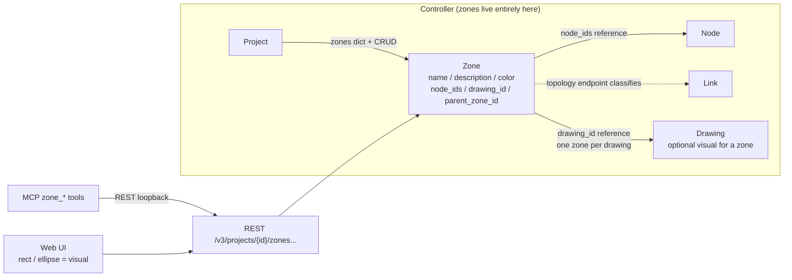
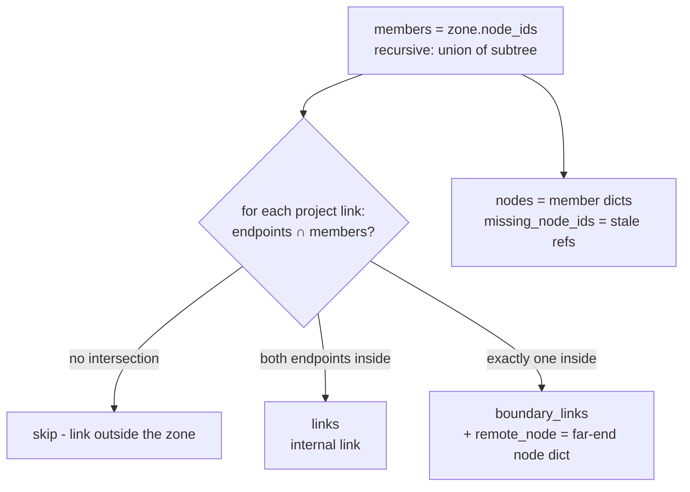

# Zones (Node Grouping)

## Overview

Zones are named groups of nodes persisted in the `.gns3` project file. They let a client (typically an AI agent, or the Web UI) load and operate on one part of a big topology instead of the whole thing — e.g. 50 nodes split into 10 zones, one agent per zone. Zones are pure controller-side data: they never touch computes, and membership is always an explicit list of node IDs (moving a shape on the scene never changes data).

Motivated by [issue #2843](https://github.com/GNS3/gns3-server/issues/2843).

## Architecture



Key relationships:

- **Zone → nodes**: explicit `node_ids` list; a node may belong to several zones.
- **Zone → drawing**: optional `drawing_id` binds a rectangle/ellipse drawing as the zone's visual representation. The drawing is just the picture — one drawing can be bound to at most one zone (409 otherwise); deleting the drawing unbinds it and the zone survives as pure data.
- **Zone → zone**: optional `parent_zone_id` for nesting (campus > dc > rack). Membership never cascades implicitly; `?recursive=true` folds descendants in on demand.

## Business Process

Zone sub-topology classification (`GET .../zones/{zone_id}/topology`):



A link between two zones is a boundary link for **both** zones (each sees the other's node as `remote_node`).

Response shape:

```json
{
  "zone": {"zone_id": "...", "name": "site-A", "color": "#4A90D9",
           "node_ids": ["..."], "drawing_id": "...", "parent_zone_id": null},
  "nodes": ["... full member node objects ..."],
  "links": ["... links with both endpoints inside ..."],
  "boundary_links": [
    {"link_id": "...", "nodes": ["..."],
     "remote_node": {"node_id": "...", "name": "core-r1", "node_type": "qemu", "...": "..."}}
  ],
  "missing_node_ids": [],
  "sub_zone_ids": []
}
```

## API Endpoints

All under `/v3/projects/{project_id}/zones` (routes: `gns3server/api/routes/controller/zones.py`):

| Method | Path | Description | Privilege |
|--------|------|-------------|-----------|
| GET | `/` | List zones (works on closed projects, read from the `.gns3`) | Zone.Audit |
| POST | `/` | Create a zone (201). Validates `drawing_id` binding (409 if taken) and `parent_zone_id` (404 unknown, 409 self/cycle) | Zone.Allocate |
| GET | `/{zone_id}` | Zone definition | Zone.Audit |
| PUT | `/{zone_id}` | Partial update; `node_ids` replaces the member list wholesale | Zone.Modify |
| DELETE | `/{zone_id}` | Delete the zone; member nodes untouched, child zones unparented | Zone.Allocate |
| GET | `/{zone_id}/topology` | Sub-topology (see above); `?recursive=true` folds descendant zones in and reports them in `sub_zone_ids` | Zone.Audit |
| POST | `/{zone_id}/nodes` | Add a single member (body `{"node_id": ...}`). Idempotent; 404 if the node doesn't exist | Zone.Modify |
| DELETE | `/{zone_id}/nodes/{node_id}` | Remove a single member. Idempotent; also cleans stale references | Zone.Modify |
| POST | `/{zone_id}/nodes/start` | Start all zone nodes (`?recursive=true` for the subtree) | Node.PowerMgmt |
| POST | `/{zone_id}/nodes/stop` | Stop all zone nodes | Node.PowerMgmt |
| POST | `/{zone_id}/nodes/suspend` | Suspend all zone nodes | Node.PowerMgmt |
| POST | `/{zone_id}/nodes/reload` | Stop then start all zone nodes | Node.PowerMgmt |

Node-side write-through (`gns3server/api/routes/controller/nodes.py`): `POST /nodes` and `PUT /nodes/{node_id}` accept an optional `zone_ids` list which replaces the node's memberships (membership itself is still stored on the zones — no format change); `GET /nodes` and `GET /nodes/{node_id}` echo the computed `zone_ids`, closed projects included.

Notifications (project stream / WebSocket): `zone.created`, `zone.updated`, `zone.deleted` with the full zone dict as payload — same pattern as drawings.

## Notes

- **File format compatibility**: zones are stored as an additive `topology.zones` key in the `.gns3` file — no revision bump. Pre-zones servers open such files fine (unknown key ignored) but silently drop zones when re-saving; pre-zones files load as zero zones. `regenerate_topology_ids` (`gns3server/controller/import_project.py`) remaps zone IDs and their node / drawing / parent references on import and duplication, dropping stale node references.
- **Referential integrity**: deleting a node removes it from all zones (with `zone.updated` per zone); deleting a drawing unbinds its zone; deleting a parent zone unparents its children. Zone reads tolerate stale member IDs (`missing_node_ids`).
- **Nesting**: unlimited depth. Writes validate the ancestor chain (no self-parent, no cycles — 409); the subtree walk carries a visited set as a guard against cycles in hand-edited files.
- **RBAC**: `Zone.Allocate` / `Zone.Audit` / `Zone.Modify` privileges, granted to User (all three) and Auditor (Audit) roles; Alembic migration seeds existing databases.
- **MCP**: twelve tools (`zone_list/get/create/update/delete`, `zone_node_add/remove`, `zone_start/stop/suspend/reload`, `zone_topology` with `recursive`) — see `docs/features/mcp-service.md`.
- **Web UI**: a zone's visual is its bound drawing (rectangle/ellipse); "lasso nodes into a zone" is a client-side computation (node x/y vs. the drawing) followed by `POST /zones` with `node_ids` + `drawing_id`. Dragging a node in/out of the shape maps to the single-member add/remove endpoints. Zones without a bound drawing can render as an auto-computed bounding box of their members.
